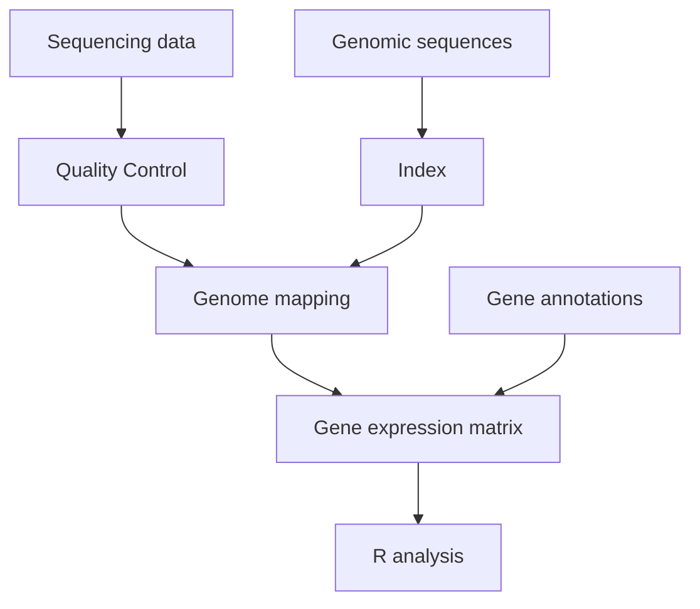
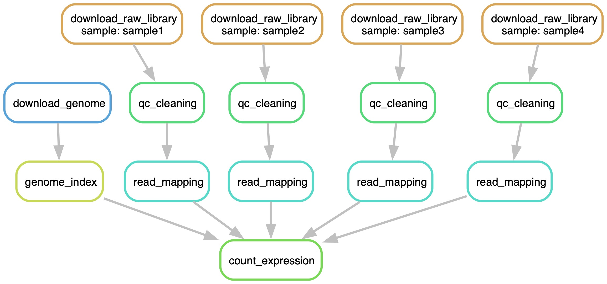
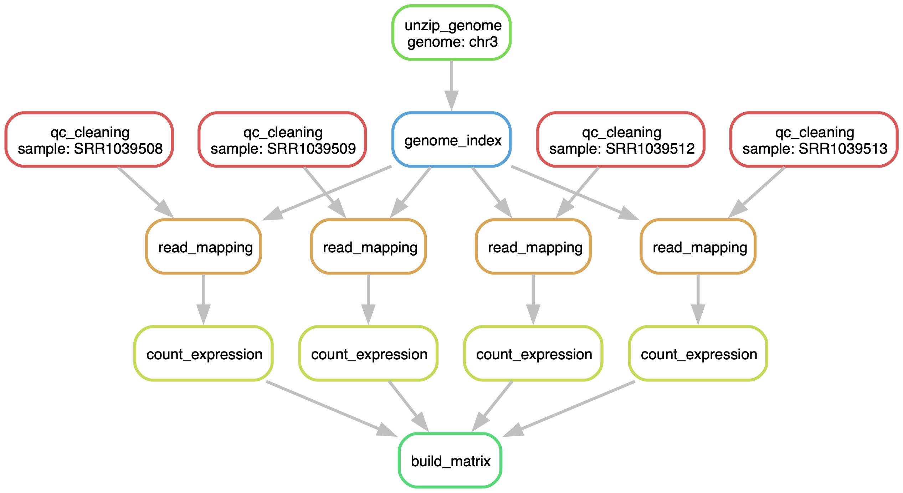

# Snakemake Transcriptomics Intro


This readme file contains:

- Instructions on the software installation
- Short introduction into the a concept of workflow with mockup scripts that generate empty files
- A tutorial workflow on a small biological dataset

The tutorial dataset is designed such that the entire workflow should be able to run on a recent consumer-grade notebook in under $15$ minutes.

For demonstration purposes, this tutorial workflow contains only the read cleaning,
read mapping, and expression quantification steps.
The general structure and dependencies between the workflow steps are:





## Installation

This tutorial uses
[Snakemake](https://snakemake.readthedocs.io/en/stable/getting_started/installation.html)
and its
[Wrappers](https://snakemake-wrappers.readthedocs.io/en/stable/)
in the tutorial. For this tutorial, please install Snakemake and the
software management tool mamba
(generally "*better/faster*" version of conda).
I would recommend the 
[mambaforge](https://mamba.readthedocs.io/en/latest/installation/mamba-installation.html)
distribution, which can be easily installed on
MacOS via 
[Homebrew](https://brew.sh/)
(a similarly named package should exist in your favorite apt/yum repository for Linux users)


```
brew install mambaforge
mamba init
mamba install -c bioconda -n base snakemake
```

**Note:** MacOS Silicon architecture

This tutorial will use pipeline will use software from
[Bioconda](https://bioconda.github.io/) project, which does not yet
support Apple Silicon (M1/M2). Therefore, please install snakemake
explicitly as a osx-64 binary

```
CONDA_SUBDIR=osx-64 mamba create -c conda-forge -c bioconda -n snakemake64 snakemake
mamba activate snakemake64
conda config --env --set subdir osx-64
# this is needed for the software installations that snakemake requests
export CONDA_SUBDIR=osx-64
```

Then download this tutorial:

```
git clone https://github.com/asgeissler/2024-Snakemake-Intro
```


## Workflow concept


In order to illustrate the steps of the pipeline, a bash implemented mockup 
that only creates empty files is in the
`1-Concept-Bash-Workflow` directory.

```
$ cd 1-Concept-Bash-Workflow
$ bash concept-pipeline.sh
```

First, the script generates these empty files to simulate the workflow input:

    .
    ├── genome.fna.gz
    ├── genome.gff.gz
    └── raw-data
        ├── sample1.fastq.gz
        ├── sample2.fastq.gz
        ├── sample3.fastq.gz
        └── sample4.fastq.gz


Using for loops, the script prints out hypothetical commands to 
facilitate the quality control (qcTool), genome indexing (makeIndex),
read mapping (mapTool), and expression quantification (countExpression):


      qcTool raw-data/sample1.fastq.gz > clean-data/sample1.fastq.gz
      qcTool raw-data/sample2.fastq.gz > clean-data/sample2.fastq.gz
      qcTool raw-data/sample3.fastq.gz > clean-data/sample3.fastq.gz
      qcTool raw-data/sample4.fastq.gz > clean-data/sample4.fastq.gz
      makeIndex genome.fna.gz index
      mapTool index clean-data/sample1.fastq.gz > mapping/sample1.bam
      mapTool index clean-data/sample2.fastq.gz > mapping/sample2.bam
      mapTool index clean-data/sample3.fastq.gz > mapping/sample3.bam
      mapTool index clean-data/sample4.fastq.gz > mapping/sample4.bam
      countExpression annotation.gff.gz mapping/* > matrix.txt


While these tools do not exist, and the
`concept-pipeline.sh` script creates empty files instead,
the simulated output shows how the output of a preceding processing steps
becomes the input of the next steps.

After running the script, the following empty files simulate what the structure
of the output looks like:


    ├── clean-data
    │   ├── sample1.fastq.gz
    │   ├── sample2.fastq.gz
    │   ├── sample3.fastq.gz
    │   └── sample4.fastq.gz
    ├── genome.fna.gz
    ├── genome.gff.gz
    ├── index
    ├── mapping
    │   ├── sample1.bam
    │   ├── sample2.bam
    │   ├── sample3.bam
    │   └── sample4.bam
    ├── matrix.txt
    └── raw-data
        ├── sample1.fastq.gz
        ├── sample2.fastq.gz
        ├── sample3.fastq.gz
        └── sample4.fastq.gz

This outline of a workflow with bash has multiple issues, for example:

- Adding new samples and running the workflow is time inefficient, because *all*
  steps will be repeated, and all existing files will be overwritten

- Manually copying and pasting parts of the code, for example to rerun the mapping with
  potentially different parameters, lead to inconsistency in the data.
  Of course, the subsequent expression quantification would have needed
  a rerun, which requires further manual intervention.

- Multiple steps in each for loop could run in parallel, which would greatly
  decrease the overall run-time.  Although it is possible to run commands
  in parallel in a bash script, handling the additional complexity can
  be non-trivial (*e.g*, not starting a subsequent before all preceding
  steps are completed).

- The pipeline might describe the individual commands, but not which software
  versions were used. Thus, re-running the workflow at a later time point
  might result in different results if the software, or worse, the pipeline
  might not run at all if the software was removed.


A Snakemake workflow will be able to address all of these concerns.
For illustration purposes, I implemented the same
conceptual workflow from the bash script as a Snakemake workflow in the
`2-Concept-Snakemake-Workflow` folder.

When requesting Snakemake to produce the expression matrix file 
`matrix.txt`, all proceeding steps are inferred and computed as needed.
A visual representation of all executed steps can be created with:


```
cd 2-Concept-Snakemake-Workflow
snakemake --dag matrix.txt | dot -Tjpg -Gdpi=300 > concept-workflow.jpg
```




Thanks to the `--cores` parameter, it is easy to have jobs run in parallel.
It is even possible to use Snakemake in combination which
[computer clusters and cloud computers](https://snakemake.readthedocs.io/en/v6.8.1/executing/cloud.html)! 

Running the conceptual pipeline is then a simple call:

```
$ snakemake --cores all matrix.txt
Building DAG of jobs...
Using shell: /bin/bash
Provided cores: 10
Rules claiming more threads will be scaled down.
Job stats:
job                     count
--------------------  -------
count_expression            1
download_genome             1
download_raw_library        4
genome_index                1
qc_cleaning                 4
read_mapping                4
total                      15

Select jobs to execute...

[Fri Jan 26 15:53:14 2024]
rule download_raw_library:
    output: raw-data/sample1.fastq.gz
    jobid: 5
    reason: Missing output files: raw-data/sample1.fastq.gz
    wildcards: sample=sample1

...
```

The run will result in these files (for illustration purposes, still empty)

```
2-Concept-Snakemake-Workflow
├── Snakefile
├── clean-data
│   ├── sample1.fastq.gz
│   ├── sample2.fastq.gz
│   ├── sample3.fastq.gz
│   └── sample4.fastq.gz
├── genome.fna.gz
├── genome.gff.gz
├── index
├── mapping
│   ├── sample1.bam
│   ├── sample2.bam
│   ├── sample3.bam
│   └── sample4.bam
├── matrix.txt
└── raw-data
    ├── sample1.fastq.gz
    ├── sample2.fastq.gz
    ├── sample3.fastq.gz
    └── sample4.fastq.gz
```


## Workflow on a biological dataset

This tutorial uses a subset of sequenced samples from the publication:

Himes, X. A. W., Blanca E. AND Jiang.
[RNA-seq transcriptome profiling identifies CRISPLD2 as a glucocorticoid responsive gene that modulates cytokine function in airway smooth muscle cells.](https://doi.org/10.1371/journal.pone.0099625)
PLOS ONE 9, 1–13 (2014).

**In summary:** The study investigated the changes in gene expression levels
after asthma drug treatment in human cell lines.
This tutorial contains two control samples
(`SRR1039508` and `SRR1039512``)
and two Dexamethasone treated samples (`SRR1039509` and `SRR1039513`).
This tutorial provides a subset of $50,000$ read pairs per sample
(the full libraries contain $16-28$ million read pairs).

The tutorial pipeline in `3-Tutorial-Workflow` folder implements the
read quality-control step (rule `qc_cleaning`),
read mapping (rule `read_mapping`), and
gene expression quantification per library (`count_expression`).
The rule `build_matrix` creates a single tabular file that combines
all expression values. The workflow and the connections between all steps
in creating the expression matrix file are as follows:

```
cd 3-Tutorial-Workflow
snakemake --dag gene-expression-matrix.tsv | dot -Tjpg -Gdpi=300 > tutorial-workflow.jpg
```




The command to run the entire workflow to create the expression table is:

```
snakemake --cores all --use-conda --conda-frontend=mamba gene-expression-matrix.tsv
```

The parameters indicate that all cores of the machine should be used
(`--cores all`),
that snakemake should use the mamba solver
(`--conda-frontent=mamba`)
to install the needed software dependencies
(`--use-conda`).
*Info:* All software will be installed in the hidden folder
`.snakemake/conda`.

The entire workflow run should complete in $<15$ on a recent
consumer-grade notebook. The run results in the expression table in the following
format:


```
$ head -n 3 gene-expression-matrix.tsv
Geneid	Chr	Start	End	Strand	Length	SRR1039508	SRR1039509	SRR1039512	SRR1039513
ENSG00000223587.2	chr3	11745	24849	+	13105	0	1	0	0
ENSG00000224918.1	chr3	53348	54346	-	999	0	0	0	0

$  grep ENSG00000163884.4 gene-expression-matrix.tsv
ENSG00000163884.4	chr3	126342635	126357408	-	14774	220	3384	128	1518
```

For your convenience, I added a rule `report` that will create the file
`report/multiqc.html` that summarizes the
statistics from each computational step in a single file.

```
snakemake --cores all --use-conda --conda-frontend=mamba report
```

After running the steps above, these files were created:

```
3-Tutorial-Workflow
├── Snakefile
├── chr3.fna.gz
├── chr3.gff
├── chr3_index
│   ├── Genome
│   ├── Log.out
│   ├── SA
│   ├── SAindex
│   ├── chrLength.txt
│   ├── chrName.txt
│   ├── chrNameLength.txt
│   ├── chrStart.txt
│   └── genomeParameters.txt
├── clean-data
│   ├── SRR1039508-fastp.json
│   ├── SRR1039508.html
│   ├── SRR1039508_1.fastq.gz
│   ├── SRR1039508_2.fastq.gz
│   ├── SRR1039509-fastp.json
│   ├── SRR1039509.html
│   ├── SRR1039509_1.fastq.gz
│   ├── SRR1039509_2.fastq.gz
│   ├── SRR1039512-fastp.json
│   ├── SRR1039512.html
│   ├── SRR1039512_1.fastq.gz
│   ├── SRR1039512_2.fastq.gz
│   ├── SRR1039513-fastp.json
│   ├── SRR1039513.html
│   ├── SRR1039513_1.fastq.gz
│   └── SRR1039513_2.fastq.gz
├── featureCount
│   ├── SRR1039508.featureCounts
│   ├── SRR1039508.featureCounts.summary
│   ├── SRR1039509.featureCounts
│   ├── SRR1039509.featureCounts.summary
│   ├── SRR1039512.featureCounts
│   ├── SRR1039512.featureCounts.summary
│   ├── SRR1039513.featureCounts
│   └── SRR1039513.featureCounts.summary
├── gene-expression-matrix.tsv
├── logs
│   ├── SRR1039508.log
│   ├── SRR1039509.log
│   ├── SRR1039512.log
│   ├── SRR1039513.log
│   ├── fastp
│   │   ├── SRR1039508.log
│   │   ├── SRR1039509.log
│   │   ├── SRR1039512.log
│   │   └── SRR1039513.log
│   ├── multiqc.log
│   ├── star
│   │   ├── SRR1039508.log
│   │   ├── SRR1039509.log
│   │   ├── SRR1039512.log
│   │   └── SRR1039513.log
│   └── star_index_chr3.log
├── raw-data
│   ├── SRR1039508_1.fastq.gz
│   ├── SRR1039508_2.fastq.gz
│   ├── SRR1039509_1.fastq.gz
│   ├── SRR1039509_2.fastq.gz
│   ├── SRR1039512_1.fastq.gz
│   ├── SRR1039512_2.fastq.gz
│   ├── SRR1039513_1.fastq.gz
│   └── SRR1039513_2.fastq.gz
├── report
│   ├── multiqc.html
│   └── multiqc_data
│       ├── multiqc.log
│       ├── multiqc_citations.txt
│       ├── multiqc_data.json
│       ├── multiqc_fastp.txt
│       ├── multiqc_featureCounts.txt
│       ├── multiqc_general_stats.txt
│       ├── multiqc_software_versions.txt
│       ├── multiqc_sources.txt
│       └── multiqc_star.txt
└── star
    ├── SRR1039508.Log.final.out
    ├── SRR1039508.Log.out
    ├── SRR1039508.sam
    ├── SRR1039508.sj.out.tab
    ├── SRR1039509.Log.final.out
    ├── SRR1039509.Log.out
    ├── SRR1039509.sam
    ├── SRR1039509.sj.out.tab
    ├── SRR1039512.Log.final.out
    ├── SRR1039512.Log.out
    ├── SRR1039512.sam
    ├── SRR1039512.sj.out.tab
    ├── SRR1039513.Log.final.out
    ├── SRR1039513.Log.out
    ├── SRR1039513.sam
    └── SRR1039513.sj.out.tab
 ```


